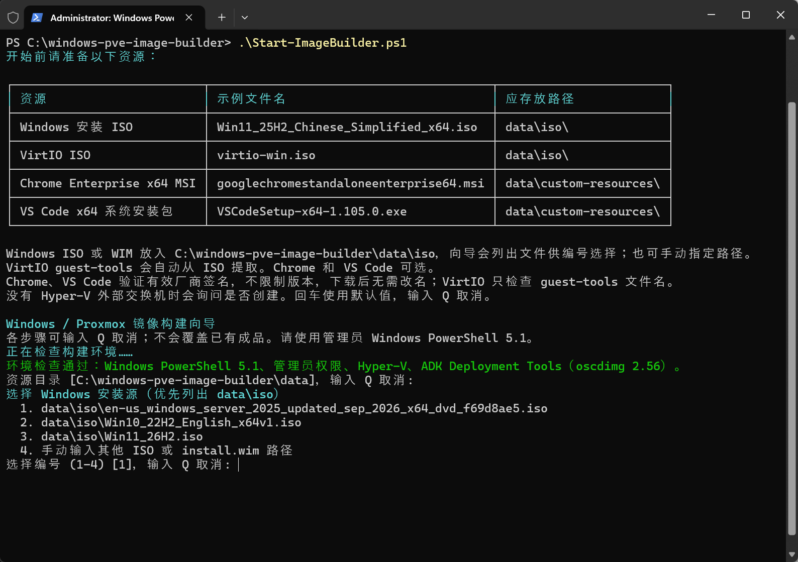

# Windows Imaging Tools Builder

本项目通过PowerShell 向导构建包含 VirtIO 与 Cloudbase 的 Windows qcow2 镜像，供 Proxmox VE（PVE）使用。
项目基于 [windows-imaging-tools](https://github.com/cloudbase/windows-imaging-tools)。

## 准备环境

构建主机需要以下组件：

- Windows PowerShell 5.1。
- Git for Windows。
- Hyper-V。
- [Windows ADK](https://learn.microsoft.com/windows-hardware/get-started/adk-install) 的 Deployment Tools。

使用管理员权限运行 Windows PowerShell 5.1。

从以下地址下载资源，放入项目对应的文件夹中：

| 资源 | 下载地址 | 示例文件名 | 应存放路径 |
|---|---|---|---|
| Windows 安装 ISO | [Massgrave Genuine Installation Media](https://massgrave.dev/genuine-installation-media) | `Win11_25H2_Chinese_Simplified_x64.iso` | `data/iso/` |
| VirtIO ISO | [Latest ISO](https://fedorapeople.org/groups/virt/virtio-win/direct-downloads/latest-virtio/virtio-win.iso) · [Stable ISO](https://fedorapeople.org/groups/virt/virtio-win/direct-downloads/stable-virtio/virtio-win.iso) | `virtio-win.iso` | `data/iso/` |
| Chrome Enterprise x64 MSI | [最新安装包](https://dl.google.com/dl/chrome/install/googlechromestandaloneenterprise64.msi) · [官方下载页](https://chromeenterprise.google/download/) | `googlechromestandaloneenterprise64.msi` | `data/custom-resources/` |
| VS Code x64 系统安装包 | [Latest Stable](https://update.code.visualstudio.com/latest/win32-x64/stable) | `VSCodeSetup-x64-1.105.0.exe` | `data/custom-resources/` |

将 Chrome 和 VS Code 安装包放入 `data/custom-resources/`，无需改名，可以分别选择是否安装 Chrome 和 VS Code。

Cloudbase-Init 在首次构建时自动从官网下载，默认保存到 `data/assets/CloudbaseInitSetup_Stable_x64.msi`。
需要更新 Cloudbase-Init 时，删除已保存的安装包后重新构建即可。

## 开始构建


将项目放在较短的路径。
在管理员 Windows PowerShell 5.1 中运行以下命令：

```powershell
git -c core.longpaths=true clone --recurse-submodules https://github.com/Linvery/windows-imaging-tools-builder.git
Set-Location windows-imaging-tools-builder
# 将 Windows 和 VirtIO ISO 放入 data\iso 后启动向导
.\Start-ImageBuilder.ps1
```

向导启动时会检查 PowerShell 版本、管理员权限、Hyper-V 和 ADK。
如果缺少组件，向导会显示安装提示。
按提示选择安装源、Windows 版本、资源目录、Hyper-V 外部交换机、输出路径和软件。

默认输出文件名为 `系统简称-yyyyMMddHHmm.qcow2`，例如 `WinServer2025-202610090241.qcow2`，也可以在向导中自行填写输出路径。

按回车可使用当前步骤的默认值。
输入 `Q` 可取消向导。
最后选择以下操作之一：

- **开始构建**：生成配置并构建镜像。
- **预检**：检查构建条件。
- **仅保存配置**：生成配置文件。

“下一步”的默认操作为“开始构建”。
预检会检查主机环境、资源、安装源版本、CPU、内存和磁盘空间，不会启动构建。

默认构建设置如下：

| 设置 | 默认值 |
|---|---|
| 启动方式 | UEFI |
| CPU | 4 核 |
| 内存 | 8 GiB |
| 系统盘 | 128 GiB |

如果主机资源不足，向导会降低 CPU 和内存的默认值。
默认系统盘大小为 128 GiB，输出路径所在磁盘必须有至少 276 GiB 可用空间。

构建按以下顺序执行：

1. 安装驱动。
2. 安装软件。
3. 运行 Sysprep。
4. 压缩镜像。
5. 检查镜像启动。

项目将成品保存到指定的输出路径。
项目将日志保存到资源目录的 `logs/`。

构建期间按 `Ctrl+C` 可中断构建。
中断后，项目会询问是否清理本轮临时资源。
按回车默认选择“是”。
选择“否”后，项目会保留临时虚拟机和中间文件，供排查问题。
清理操作会保留 ISO、安装包、日志和已有镜像。

镜像启用远程桌面（RDP），并保留网络级别身份验证（NLA）。
镜像关闭 Windows 防火墙。
首次启动前，使用 PVE Cloud-Init 设置 `Administrator` 密码。
账号处理规则见[账号配置](docs/account-bootstrap.md)。

### 选择产品密钥

选择 Windows 版本后，向导提供两个选项：

1. **当前版本对应的 KMS 密钥**。
2. **自行填写/留空**。

向导默认使用[微软公开的 KMS 客户端安装密钥](https://learn.microsoft.com/windows-server/get-started/kms-client-activation-keys)。
选择第二项后，直接按回车可留空。
向导会隐藏自行填写的密钥，配置摘要也不会显示密钥。
产品密钥用于安装 Windows。
激活 Windows 仍需合法授权和可用的激活环境。

### 设置 KMS 地址

选择产品密钥后，向导提供两个 KMS 地址选项：

1. **kms-default.cangshui.net**：默认选项。
2. **自定义输入/留空**。

自定义地址支持域名和 IP 地址。
地址可以包含端口，默认端口为 `1688`。
IPv6 地址包含端口时，使用 `[地址]:端口` 格式。
选择第二项后，直接按回车可留空，项目不会设置 KMS 地址。

构建期间不会请求激活。
部署后首次启动时，系统会使用所选 KMS 地址尝试一次 Windows KMS 激活。
只有配置了 KMS 地址并安装 Windows KMS 客户端安装密钥时，才会尝试激活。

项目将激活结果保存到 `C:\ProgramData\PveImageBuilder\windows-activation.json`。
未联网、KMS 不可达或激活失败都不会阻断 Cloudbase-Init 初始化。
激活过程不会要求重启。

通过命令行生成配置时，使用 `New-ImageConfig.ps1 -KmsServer 'kms.example.com:1688'` 指定 KMS 地址。
传入 `-KmsServer ''` 可将 KMS 地址留空。

## 常用命令

运行以下命令可通过向导生成配置：

```powershell
.\Start-ImageBuilder.ps1 -ConfigureOnly
```

每次运行向导都会在 `local/configs/` 保存独立配置，便于分别保留 Windows 11 和 Windows Server 2025 的配置。
将以下示例路径替换为向导显示的配置路径。
第一条命令执行预检。
第二条命令开始构建。

```powershell
.\Build-Image.ps1 -ConfigPath .\local\configs\image-日期-编号.ini -WhatIf
.\Build-Image.ps1 -ConfigPath .\local\configs\image-日期-编号.ini
```

关闭使用源镜像的虚拟机。
运行以下命令可压缩已有的离线镜像：

```powershell
.\Compress-Image.ps1 -SourcePath .\data\output\source.qcow2 -OutputPath .\data\output\compressed.qcow2
```

## 导入 PVE 并配置模板

将构建完成的 qcow2 镜像导入 PVE。
完成虚拟机配置后，将虚拟机转换为模板。
使用模板克隆新虚拟机。
首次启动前，为新虚拟机设置 Cloud-Init 密码和网络。

以下示例使用 Windows 11 镜像。
在 PVE 节点的 Shell 或 SSH 会话中，以 `root` 身份执行 Bash 命令。
按顺序在同一会话中执行以下步骤。

### 1. 准备镜像和参数

使用 SCP 或 SFTP 将 qcow2 镜像上传到 PVE 节点。
以下示例将镜像保存为 `/root/win11-pve.qcow2`。
上传路径只用于暂存源镜像。
PVE 会将导入的系统盘保存到目标存储。

设置以下参数：

```bash
VMID=9000
STORAGE=local-lvm
BRIDGE=vmbr0
IMAGE=/root/win11-pve.qcow2

qm list
pvesm status
qemu-img info "$IMAGE"
```

将 `VMID` 替换为集群中未使用的虚拟机 ID。
将 `STORAGE` 替换为可保存虚拟机磁盘的存储 ID。
目标存储必须有足够空间保存系统盘、EFI 盘和 TPM 状态盘。
将 `BRIDGE` 替换为目标网络桥接名称。
将 `IMAGE` 替换为上传镜像的绝对路径。
确认 `qemu-img info` 输出的格式为 `qcow2`。

### 2. 创建虚拟机并导入系统盘

创建使用 OVMF（UEFI）的虚拟机：

```bash
qm create "$VMID" --name win11-template \
  --ostype win11 --machine q35 --bios ovmf \
  --sockets 1 --cores 4 --cpu host --memory 8192 --balloon 0 \
  --scsihw virtio-scsi-single \
  --net0 "virtio,bridge=${BRIDGE}" \
  --agent enabled=1 --vga std

qm set "$VMID" --efidisk0 "${STORAGE}:0,efitype=4m,pre-enrolled-keys=1"
qm set "$VMID" --tpmstate0 "${STORAGE}:0,version=v2.0"
qm set "$VMID" --scsi0 "${STORAGE}:0,import-from=${IMAGE},discard=on,iothread=1"
qm set "$VMID" --boot order=scsi0
```

使用 `import-from` 导入 qcow2 镜像后，系统盘连接到 `scsi0`。
系统盘使用 VirtIO SCSI 控制器。
设置 `pre-enrolled-keys=1` 后，EFI 盘包含预置密钥并启用 Secure Boot。
TPM 状态盘提供 TPM 2.0。
`--agent enabled=1` 启用 PVE 与 QEMU Guest Agent 的通信。
项目已在镜像中安装 QEMU Guest Agent。

导入 `local-lvm` 或 ZFS 存储后，系统盘使用存储支持的格式，不必保持 qcow2 文件格式。
如果使用支持 qcow2 的目录存储，可在 `scsi0` 参数中添加 `format=qcow2`。
如果需要跨节点迁移，请使用目标节点支持的 CPU 类型。

### 3. 添加 Cloud-Init 配置盘

**在 OVMF（UEFI）模式下，Cloud-Init 配置盘必须使用 SATA。**
本示例将 Cloud-Init 配置盘连接到 `sata0`。
系统盘继续使用 `scsi0`。

```bash
qm set "$VMID" --sata0 "${STORAGE}:cloudinit"
qm set "$VMID" --citype configdrive2 --ciuser Administrator
qm set "$VMID" --ipconfig0 ip=dhcp
qm cloudinit update "$VMID"
qm config "$VMID"
```

`citype` 应设为 `configdrive2`，以便 Cloudbase-Init 从配置盘读取账号密码和网络设置。
`ipconfig0` 对应 `net0`。
上述配置使用 DHCP。
使用 DHCP 时，目标网络必须提供 DHCP 服务。

检查 `qm config` 输出中的关键设置：

| 设置 | 期望值 |
|---|---|
| `bios` | `ovmf` |
| `machine` | `q35` |
| `ostype` | `win11` |
| `scsihw` | `virtio-scsi-single` |
| `scsi0` | 导入的系统盘 |
| `boot` | `order=scsi0` |
| `sata0` | Cloud-Init 配置盘，包含 `media=cdrom` |
| `citype` | `configdrive2` |
| `ciuser` | `Administrator` |
| `agent` | `enabled=1` |

### 4. 转换为模板

直接将未启动的虚拟机转换为模板。
镜像已在构建阶段完成 Sysprep。
启动模板虚拟机会消耗首次初始化状态。
使用克隆虚拟机验证首次启动。

```bash
qm template "$VMID"
```

### 5. 克隆并配置新虚拟机

将 `NEW_VMID` 替换为集群中未使用的虚拟机 ID。
以下命令创建完整克隆：

```bash
NEW_VMID=100
qm clone "$VMID" "$NEW_VMID" --name win11-100 --full 1 --storage "$STORAGE"
qm set "$NEW_VMID" --ostype win11 --citype configdrive2 --ciuser Administrator
qm set "$NEW_VMID" --ipconfig0 ip=dhcp

read -r -s -p 'Administrator password: ' CI_PASSWORD
printf '\n'
qm set "$NEW_VMID" --cipassword "$CI_PASSWORD"
unset CI_PASSWORD
qm cloudinit update "$NEW_VMID"
```

输入符合 Windows 密码策略的密码，终端不会显示密码。
**必须先将操作系统类型设为 Windows，再写入 Cloud-Init 密码。**
如果操作系统类型不是 Windows，PVE 会将密码转换为哈希值。
Cloudbase-Init 会将哈希值作为登录密码使用。

如果需要静态 IPv4 地址，在首次启动前运行以下命令。
将地址、网关和 DNS 服务器替换为目标网络的值。

```bash
qm set "$NEW_VMID" --ipconfig0 ip=192.168.10.100/24,gw=192.168.10.1
qm set "$NEW_VMID" --nameserver 192.168.10.1
qm cloudinit update "$NEW_VMID"
```

也可以在 PVE 网页界面的“Cloud-Init”页面设置密码和网络。
修改后，点击“重新生成镜像”。
首次启动前，确认克隆虚拟机的 Cloud-Init 配置盘仍连接到 SATA。

启动新虚拟机：

```bash
qm start "$NEW_VMID"
```

等待 Windows 和 Cloudbase-Init 完成初始化。
初始化期间，虚拟机可能因计算机名变更而自动重启。
初始化完成后，使用 `Administrator` 和设置的密码，通过 PVE 控制台或 RDP 登录。

首次初始化会验证设置的密码。
密码验证成功后，额外的 `Admin` 账号会被禁用。
账号处理规则见[账号配置](docs/account-bootstrap.md)。

PVE 命令说明见 [qm 手册](https://pve.proxmox.com/pve-docs/qm.1.html)。
Windows 初始化说明见 [PVE Cloud-Init 文档](https://pve.proxmox.com/wiki/Cloud-Init_Support)。
